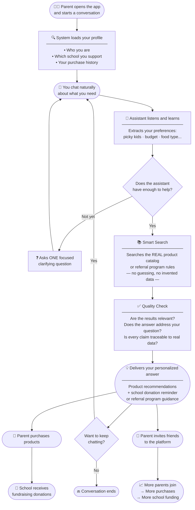

# Carton Caps Conversational Assistant — How It Works

> **A plain-language overview of the end-to-end process**

---

## What is this app?

Carton Caps is a school fundraising platform where parents buy everyday products — groceries, snacks, household items — and a portion of every purchase is donated to their child's school. The more parents buy, and the more they invite other parents to join, the more money the school receives.

The **Conversational Assistant** is an AI-powered guide built into the platform. It acts as a **personal shopping advisor that also cares about your school** — helping parents discover the right products through a natural conversation, while keeping the fundraising goal front and center.

---

## The Macro Process at a Glance



---

## Step-by-Step: What Happens in a Conversation

| Step | What the user sees | What the system does |
|------|-------------------|---------------------|
| **1. Open the app** | Conversation starts instantly | Loads your profile, your school, and your purchase history |
| **2. Send your first message** | Natural chat — no forms to fill | Classifies your intent: product search, referral question, or general chat |
| **3. Assistant learns your needs** | Assistant pays attention | Extracts useful signals from your words: preferences, constraints, budget, family needs |
| **4. Clarifying question (if needed)** | One focused question, never a survey | Detects if a key piece of context is still missing and asks for it before searching |
| **5. Smart catalog search** | Happens automatically | Builds an enriched search query from *everything* it knows about you — not just your last message — and searches the real product catalog |
| **6. Quality verification** | Nothing visible | Checks that retrieved results are relevant and that the answer is grounded in real data — no hallucinations |
| **7. Get your recommendation** | A personalized, grounded answer | Generates a response backed by real products and real rules, always including the school donation reminder |
| **8. Continue the conversation** | Keep asking, keep refining | Every new message makes the next recommendation more precise |
| **9. Purchase & donate** | Normal checkout | Every purchase you make funds your school automatically |
| **10. Invite friends** | Referral guidance woven naturally into the chat | The assistant surfaces the referral program at the right moment — growing the school's fundraising network |

---

## The Three Core Pillars

```
   CONVERSATION              DECISION INTELLIGENCE         KNOWLEDGE BASE
  ───────────────          ─────────────────────────       ──────────────────
  Manages the session      Accumulates what it             Holds the full product
  Knows who you are        knows about you across          catalog and referral
  Keeps the history        turns and decides               program rules —
  Delivers the response    when to search and              only real verified data,
  after quality checks     what to search for              always up-to-date
```

---

## Why It Matters

- **No guessing.** Every product recommendation comes from the real catalog. Every referral rule comes from the real program documentation.
- **No repetition.** The assistant remembers what you said earlier in the conversation — you never have to repeat yourself.
- **Always aligned with the mission.** Every interaction nudges the parent toward a purchase or a referral — both of which directly benefit the school.
- **Gets smarter with every message.** The more you talk, the better the recommendations.
